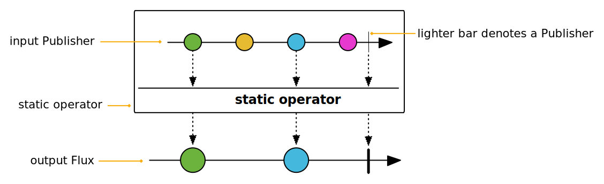
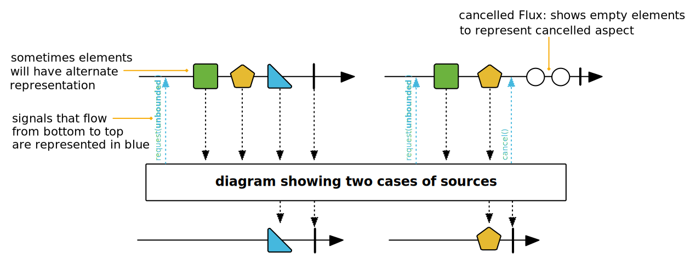
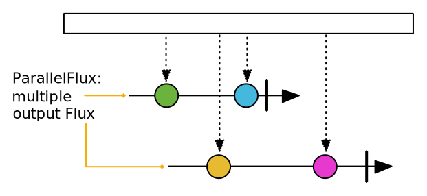
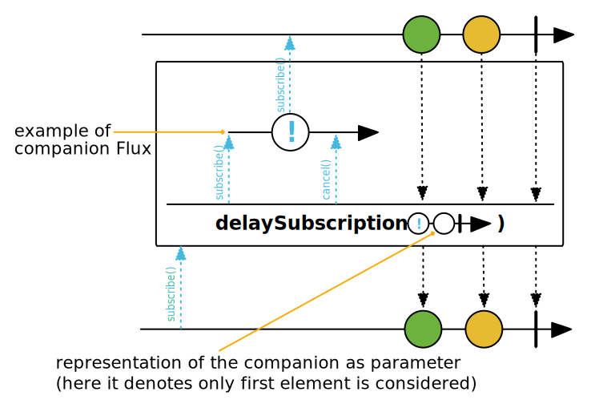
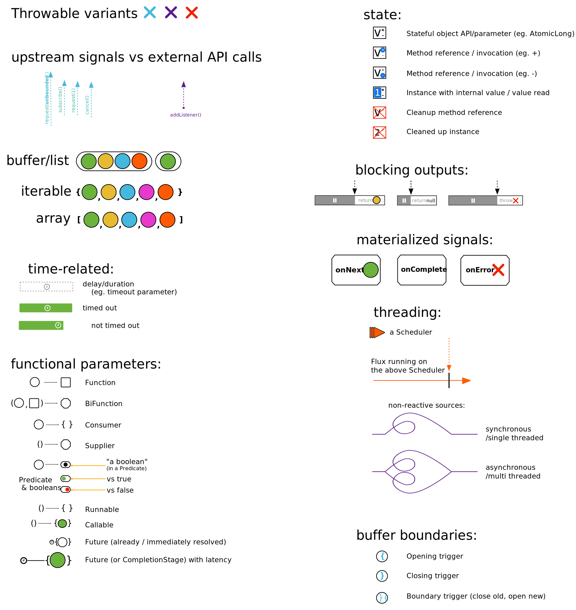

[[howtoReadMarbles]]
= How to read marble diagrams?

When we introduced `Flux` and `Mono`, we showed an example of a "marble diagram".
These are found throughout the javadoc in order to explain the behavior of an operator in a more visual way.

In this section we'll dig a little deeper into the conventions used by the Reactor documentation for these marble diagrams.
First, let's see how the most common patterns of operators are represented.

Some operators are instance methods: their output is produced by calling a method on a source `Flux` instance (like `Flux<T> output = source.fluxOperator()`):

image::images/legend-operator-method.svg[A common operator]

Other operators are static methods. They can still take a source as an input parameter, like in `Flux<T> output = Flux.merge(sourceFlux1, sourcePublisher2)`.
These are represented like below:

Note that sometimes we represent multiple variants or behaviors depending on the operator's input, in which case there's a single operator "box", but the source and output variants are separated like below:

These are the basic cases, yet some operators display slightly more advanced patterns.

For instance, `ParallelFlux` creates multiple rails so they have multiple output `Flux`.
These are represented one below the other, like in the following diagram:

Windowing operators produce a `Flux<Flux<T>>`: the main `Flux` notifies of each window opening, while inner `Flux` represent the windows content and termination.
Windows are represented as branching out of the main `Flux`, like in the following diagram:

image::images/legend-operator-windowing.svg[The output of a windowing operator]

Sometimes, operators take a "companion publisher" as input (a `Flux`, `Mono` or arbitrary Reactive Stream `Publisher`).
Such companion publishers help to customize the operator's behavior, which will use some of the companion's signals as trigger for its own internal behavior.
They are represented like in the following diagram:

Now that we've seen the most common operator patterns, let's show the graphical representation of all the different signals, events and elements that can occur in a `Flux` or `Mono`:

Finally, in the same vein we have the graphical representation of _side effects_, which occur alongside the Reactive Stream signals:

image::images/legend-sideEffects1.svg[Side effects: representation of doOn* handlers]
image::images/legend-sideEffects2.svg[Side effects: in a diagram]

