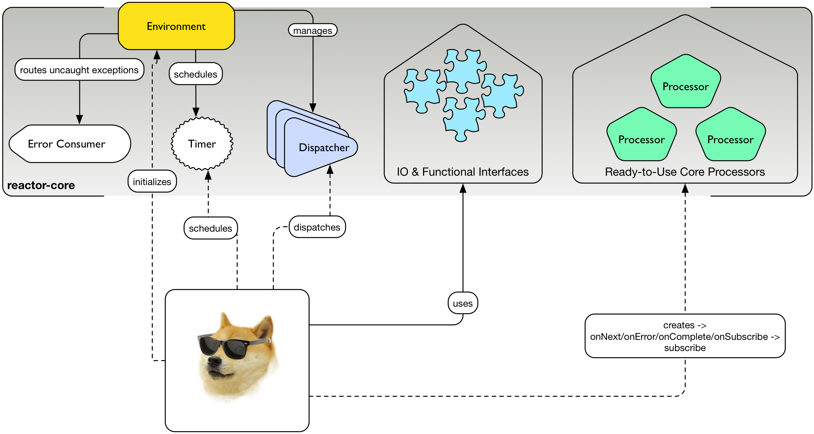

"You should never do your asynchronous work alone."
-- Jon Brisbin, After writing Reactor 1

"You should never do your asynchronous work alone."
-- Stephane Maldini, After writing Reactor 2

.Head first with a Groovy example of some Core work
[source,groovy]
----

//RingBufferDispatcher with 8192 slots by default
def dispatcher = Environment.sharedDispatcher()

//Create a callback
Consumer<Integer> c = { data ->
        println "some data arrived: $data"
}

//Create an error callback
Consumer<Throwable> errorHandler = { it.printStackTrace }

//Dispatch data asynchronously
dispatcher.dispatch(1234, c, errorHandler)

Environment.terminate()
----

.A second taster, the Reactive Streams way
[source,groovy]
----
//standalone async processor
def processor = RingBufferProcessor.<Integer>create()

//send data, will be kept safe until a subscriber attaches to the processor
processor.onNext(1234)
processor.onNext(5678)

//consume integer data
processor.subscribe(new Subscriber<Integer>(){

  void onSubscribe(Subscription s){
    //unbounded subscriber
    s.request Long.MAX
  }

  void onNext(Integer data){
    println data
  }

  void onError(Throwable err){
    err.printStackTrace()
  }

  void onComplete(){
    println 'done!'
  }
}

//Shutdown internal thread and call complete
processor.onComplete()
----

== Core Overview

.How Doge can use Reactor-Core

*Reactor Core* has the following artefacts:

****
* *Common IO & functional types*, some directly backported from Java 8 Functional Interfaces
** Function, Supplier, Consumer, Predicate, BiConsumer, BiFunction
** Tuples
** Resource, Pausable, Timer
** Buffer, Codec and a handful of predifined Codecs
* *Environment* context
* *Dispatcher* contract and a handful of predefined Dispatchers
* Predefined *Reactive Streams Processor*
****

Alone, reactor-core can already be used as a drop-in replacement for another Message-Passing strategy, to schedule timed tasks or to organize your code in small functional blocks implementing the Java 8 backport interfaces.
Such breakdown allows to play more nicely with other Reactive libraries especially removing the burden of understanding the RingBuffer for the impatient developer.

[NOTE]
Reactor-Core implicitely _shadows_ LMAX Disruptor, so it won't appear nor collide with an existing Disruptor dependency

[[core-functional]]
== Functional Artefacts
Functional reusable blocks are core and mostly a required artefact to use as soon as you get into Reactor. footnoteref:[disclaimer,Unless you only want to use the Core Processor which are mostly standalone at this stage. We plan to align Dispatcher with Core Processors overtime.]
So what's cool about Functional Programming ? One of the core ideas is to start treating executable code as a data like another. footnoteref:[disclaimer, Some will challenge that over-simplified vision but let's stay pragmatic over here :)]
To some extent it is akin to the concept of Closures or Anonymous Functions, where business logic can be decided by the original caller.
It also avoids loads of imperative IF/SWITCH blocks and makes a clear separation of concerns: each block achieves one purpose and doesn't need to share anything.

=== Organizing Functional Blocks

Every Functional component gives the explicit intent of its general mission:

* https://github.com/reactor/reactor/blob/master/reactor-core/src/main/java/reactor/fn/Consumer.java[Consumer]: simple callback - fire-and-forget
* https://github.com/reactor/reactor/blob/master/reactor-core/src/main/java/reactor/fn/BiConsumer.java[BiConsumer]: simple callback with two arguments (often used in sequence comparaisons, e.g. previous and next arguments)
* https://github.com/reactor/reactor/blob/master/reactor-core/src/main/java/reactor/fn/Function.java[Function]: transforming logic - request/reply
* https://github.com/reactor/reactor/blob/master/reactor-core/src/main/java/reactor/fn/Consumer.java[BiFunction]: transforming with two arguments (often used in accumulators, comparing previous and next arguments then returning a new value)
* https://github.com/reactor/reactor/blob/master/reactor-core/src/main/java/reactor/fn/Supplier.java[Supplier]: factory logic - polling
* https://github.com/reactor/reactor/blob/master/reactor-core/src/main/java/reactor/fn/Predicate.java[Predicate]: testing logic - filtering

[IMPORTANT]
We consider Publisher and Subscriber interfaces also *functional blocks*, dare we say _Reactive Functional Blocks_.
Nevertheless they are the basic components used everywhere around in Reactor and Beyond. Stream API will usually accept *reactor.fn* arguments to create on your behalf the appropriate Subscribers.

.The good news about wrapping executable instructions within Functional artefacts is that you can reuse them like *Lego Bricks*.
[source,java]
----
Consumer<String> consumer = new Consumer<String>(){
        @Override
        void accept(String value){
                System.out.println(value);
        }
};

//Now in Java 8 style for brievety
Function<Integer, String> transformation = integer -> ""+integer;

Supplier<Integer> supplier = () -> 123;

BiConsumer<Consumer<String>, String> biConsumer = (callback, value) -> {
        for(int i = 0; i < 10; i++){
                //lazy evaluate the final logic to run
                callback.accept(value);
        }
};

//note how the execution flows from supplier to biconsumer
biConsumer.accept(
        consumer,
        transformation.apply(
                supplier.get()
        )
);
----

It might not sound like a striking revolution at first, however this basic mindset change will reveal precious for
our mission to make asynchronous code sane and composable. The Dispatchers will use Consumer for their typed Data and Error callbacks.
The Reactor Streams module will use all these artifacts for greater good as well.

[TIP]
A good practice when using an IoC container such as Spring is to leverage the http://docs.spring.io/spring/docs/current/spring-framework-reference/html/beans.html#beans-java[Java Configuration] feature to return stateless Functional Beans.
Then injecting the blocks in a Stream pipeline or dispatching their execution becomes quite elegant.

=== Tuples

You might have noticed these interfaces are strongly typed with Generic support and a small fixed number of argument.
So how do you pass more than 1 or 2 arguments ? The answer is in one class : *Tuple*.
Tuples are like typed CSV lines in a single object instance, you want them in functional programming to keep both the type safety and a variable number of arguments.

Let's take the previous example and try replacing the double-argument BiConsumer with a single-argument Consumer:

[source,java]
----

Consumer<Tuple2<Consumer<String>, String>> biConsumer = tuple -> {
        for(int i = 0; i < 10; i++){
                //Correct typing, compiler happy
                tuple.getT1().accept(tuple.getT2());
        }
};

biConsumer.accept(
        Tuple.of(
                consumer,
                transformation.apply(supplier.get())
        )
);
----

[NOTE]
Tuples involve a bit more allocation, and that's why the common use cases of comparison or keyed signals are handled with Bi**** artifacts directly.

=== Environment

Environments are created and terminated by the reactor user (or by the extension library if available, e.g. '@Spring').
They automatically read a configuration file located in https://github.com/reactor/reactor/blob/master/reactor-core/src/main/resources/META-INF/reactor/reactor-environment.properties[META_INF/reactor/reactor-environment.properties].

[TIP]
Properties file can be tuned at runtime by providing under the classpath location 'META-INF/reactor' a desired new properties configuration.

.There switching from the default configuration at runtime is achieved by passing the followying Environment Variable: 'reactor.profiles.active'.
----
java - jar reactor-app.jar -Dreactor.profiles.active=turbo
----

.Starting and Terminating the Environment
[source,java]
----
Environment env = Environment.initialize();

//Current registered environment is the same than the one initialized
Assert.isTrue(Environment.get() == env);

//Find a dispatcher named "shared"
Dispatcher d  = Environment.dispatcher("shared");

//get the Timer bound to this environment
Timer timer = Environment.timer();

//Shutdown registered Dispatchers and Timers that might run non-daemon threads
Environment.terminate();
//An option could be to register a shutdownHook to automatically invoke terminate.
----

[TIP]
It's best to try maintaining a single Environment alive for a given JVM application. Use of _Environment.initializeIfEmpty()_ will be prefered most of the time.

=== Dispatchers

Dispatchers are there since Reactor 1, they abstract away the mean of message-passing in a common contract similar to the Java Executor.
In fact they do extend Executor!

The Dispatcher contract offers a strongly typed way to pass a signal with its Data and Error *Consumers* executed (a)synchronously.
This way we fix a first issue faced by classic Executors, the error isolation. In effect instead of interrupting the assigned resource,
the Error Consumer will be invoked. If none has been provided it will try to find an existing Environment and use its assigned _errorJournalConsumer_.

A second unique feature offered by the asynchronous Dispatcher is to allow for reentrant dispatching by using a _Tail Recurse_ strategy.
Tail Recursion is used when dispatch detects the dispatcher classLoader has been assigned to the running thread and if so, enqueue the task to be executed when the current consumer returns.

.Using a synchronous and a multi-threaded dispatcher like in this https://github.com/reactor/reactor/blob/master/reactor-core/src/test/groovy/reactor/core/dispatch/DispatcherSpec.groovy[Groovy Spock test]:
[source,groovy]
----
import reactor.core.dispatch.*

//...

given:
  def sameThread = new SynchronousDispatcher()
  def diffThread = new ThreadPoolExecutorDispatcher(1, 128)
  def currentThread = Thread.currentThread()
  Thread taskThread = null

  def consumer = { ev ->
    taskThread = Thread.currentThread()
  }

  def errorConsumer = { error ->
    error.printStackTrace()
  }

when: "a task is submitted"
  sameThread.dispatch('test', consumer, errorConsumer)

then: "the task thread should be the current thread"
  currentThread == taskThread

when: "a task is submitted to the thread pool dispatcher"
  def latch = new CountDownLatch(1)
  diffThread.dispatch('test', { ev -> consumer(ev); latch.countDown() }, errorConsumer)

  latch.await(5, TimeUnit.SECONDS) // Wait for task to execute

then: "the task thread should be different when the current thread"
  taskThread != currentThread
----

[WARNING]
Like the Executor they will miss a feature that we will add along the 2.x release line: Reactive Streams protocol.
They are ones of the few leftovers in Reactor that are not directly tied to the Reactive Streams standard directly. However,
they can be combined with the Reactor Stream to quickly fix that as we will explore in the <<streams.adoc#streams, Stream Section>>.
Essentially that means a user can directly hit them until they eventually and temporarely block since the capacity might be bounded by most Dispatcher implementations.

.An introduction to the Dispatcher family
[cols="5*", options="header, autowidth"]
|===

|Dispatcher
|From Environment
|Description
|Strengths
|Weaknesses

|*RingBuffer*
|sharedDispatcher()
|https://lmax-exchange.github.io/disruptor/[An LMAX Disruptor] RingBuffer based Dispatcher.
a|Small latency peaks tolerated

Fastest Async Dispatcher, 10-15M+ dispatch/sec on commodity hardware

Support ordering

a|'Spin' Loop when getting the next slot on full capcity

Single Threaded, no concurrent dispatch

|*Mpsc*
|sharedDispatcher() if Unsafe not available
|Alternative optimized message-passing structure.
a|Latency peaks tolerated

5-10M+ dispatch/sec on commodity hardware

Support ordering

a|Unbounded and possibly using as much available heap memory as possible

Single Threaded, no concurrent dispatch

|*WorkQueue*
|workDispatcher()
|https://lmax-exchange.github.io/disruptor/[An LMAX Disruptor] RingBuffer based Dispatcher.
a|Latency Peak tolerated for a limited time

Fastest Multi-Threaded Dispatcher, 5-10M+ dispatch/sec on commodity hardware

a|'Spin' Loop when getting the next slot on full capcity

Concurrent dispatch

Doesn't support ordering

|*Synchronous*
|dispatcher("sync") or SynchronousDispatcher.
INSTANCE
|Runs on the current thread.
a|Upstream and Consumer executions are colocated

Useful for Test support

Support ordering if the reentrant dispatch is on the current thread

a|No Tail Recursion support

Blocking

|TailRecurse
|tailRecurse() or TailRecurse
Dispatcher.
INSTANCE
|Synchronous Reentrant Dispatcher that enqueue dispatches when currently dispatching.
a|Upstream and Consumer executions are colocated

Reduce execution stack, greatly expanded by functional call chains

a|Unbounded Tail Recurse depth

Blocking

Support ordering (Thread Stealing)

|ThreadPoolExecutor
|newDispatcher(int, int, DispatcherType.
THREAD_POOL_EXECUTOR)
|Use underlying ThreadPoolExecutor message-passing
a|Multi-Threaded

Blocking Consumers, permanent latency tolerated

1-5M+ dispatch/sec on commodity hardware

a|Concurrent run on a given consumer executed twice or more

Unbounded by default

Doesn't support ordering

|Traceable
Delegating
|N/A
|Decorate an existing dispatcher with TRACE level logs.
a|Dispatch tapping

Runs slower than the delegated dispatcher alone

|Log overhead (runtime, disk)

|===

.RingBufferDispatcher at a given time T
image::images/rbd2.png[Ring Buffer message passing, width=500, align="center", link="images/rbd2.png"]

=== DispatcherSupplier

You may have noticed some Dispatchers are single-threaded, especially the `RingBufferDispatcher` and `MpscDispatcher`.
Going further, refering to the Reactive Stream specification, the Subscriber/Processor implementation should not allow for
concurrent notifications. This impacts Reactor `Streams` in particular, and trying to use `Stream.dispatchOn(Dispatcher)` with a
Dispatcher that leaves the door open to concurrent signals will fail explicitely.

There is however a way to workaround that limitation by using pools of Dispatcher or *DispatcherSupplier*. In effect, as a `Supplier` factory, the indirection offered by
`Supplier.get()` to retrieve a Dispatcher allow for interesting pooling strategy : RoundRobin, Least-Used...

`Environment` offers static helpers to create, and eventually register against the current active `Environment` pools of Dispatchers:
groups of RoundRobin returned Dispatchers. Once ready, suppliers will provide for a controlled number of Dispatchers.

.As usual with Dispatchers, `Environment` is the one-stop shop to manage them:
[source,java]
----
Environment.initialize();
//....

//Create an anonymous pool of 2 dispatchers with automatic default settings (same type than default dispatcher, default backlog size...)
DispatcherSupplier supplier = Environment.newCachedDispatchers(2);

Dispatcher d1 = supplier.get();
Dispatcher d2 = supplier.get();
Dispatcher d3 = supplier.get();
Dispatcher d4 = supplier.get();

Assert.isTrue( d1 == d3  && d2 == d4);
supplier.shutdown();

//Create and register a new pool of 3 dispatchers
DispatcherSupplier supplier1 = Environment.newCachedDispatchers(3, "myPool");
DispatcherSupplier supplier2 = Environment.cachedDispatchers("myPool");

Assert.isTrue( supplier1 == supplier2 );
supplier1.shutdown();
----

=== Timers

Dispatchers compute incoming tasks as soon as possible. Timers however come with periodic and one-time scheduling API.
Reactor Core offers an `HashWheelTimer` by default and it is automatically bound to any new Environment.
HashWheelTimers are perfect for dealing with massive concurrent in-memory scheduled tasks, it's a powerful alternative to Java `TaskScheduler`.

[WARNING]
While it is suited for windowing (mini tasks periods under the minute order of magnitude), it is not a resilient scheduler since all tasks are lost when the application shutdowns.

[TIP]
Timers will receive some attention along the next releases, e.g. we would love to add persisting/shared scheduling support with Redis.
Please voice your opinion or propose any contribution here!

.A simple timer creation as seen in one of our https://github.com/reactor/reactor/blob/master/reactor-core/src/test/groovy/reactor/fn/timer/HashWheelTimerYieldingStrategy.groovy[Groovy Spock test]:
[source,groovy]
----
import reactor.fn.timer.Timer

//...

given: "a new timer"
    Environment.initializeIfEmpty()
    Timer timer = Environment.timer()
    def latch = new CountDownLatch(10)

when: "a task is submitted"
    timer.schedule(
            { Long now -> latch.countDown() } as Consumer<Long>,
            period,
            TimeUnit.MILLISECONDS
    )

then: "the latch was counted down"
    latch.await(1, TimeUnit.SECONDS)
    timer.cancel()
    Environment.terminate()
----