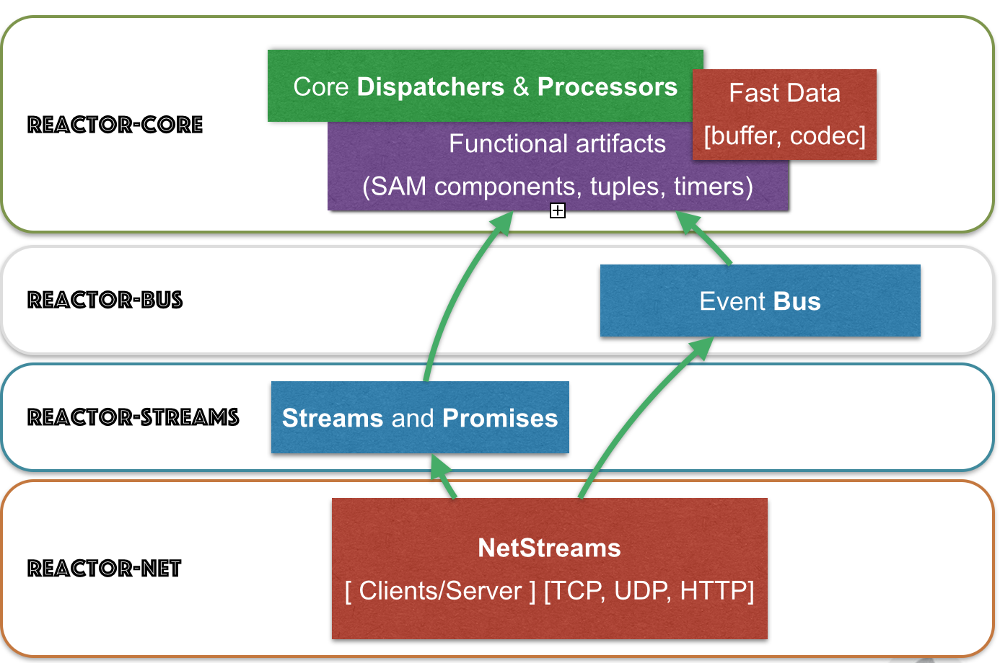
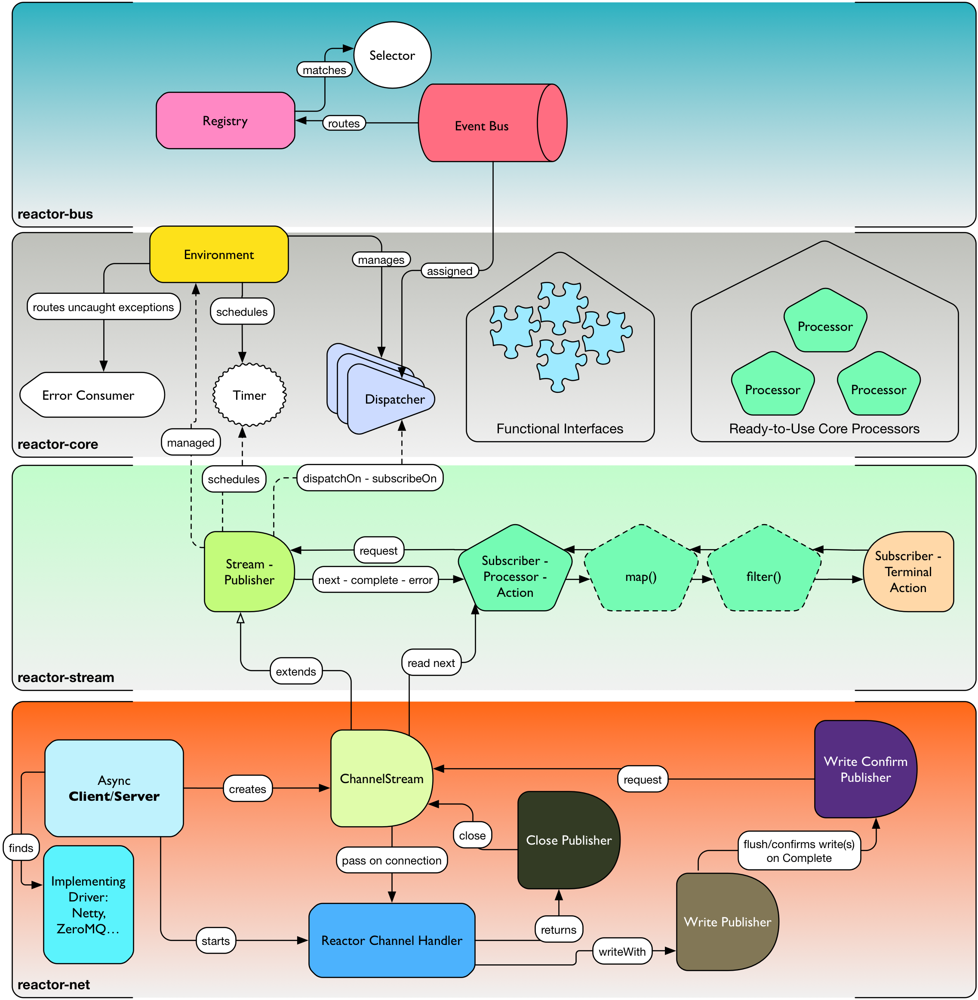
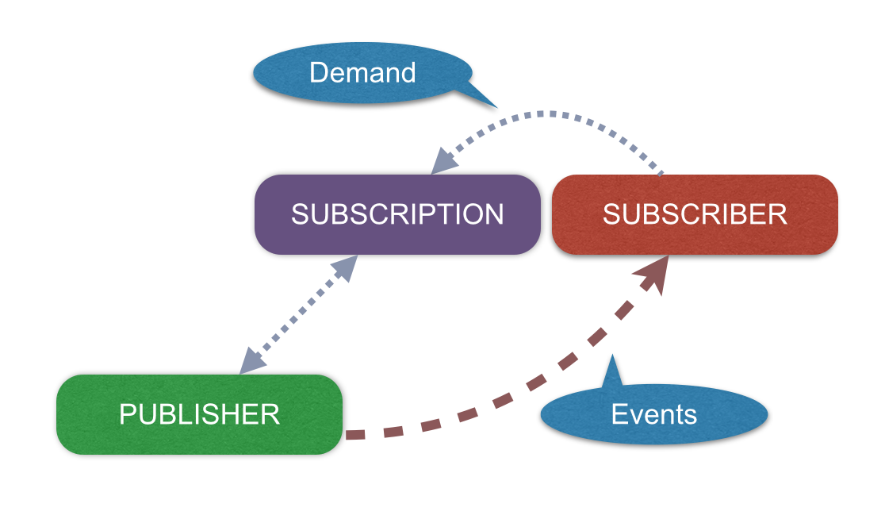

[[getting-started]]
== *Introducing Reactor*

[quote, Preface, TL;DR]
Reactor is a foundational library for building demanding, realtime *Data-Streaming* applications and micro, nano, or pico-services that must exhibit *Low-Latency* and be *Fault-Tolerant*.

[[start]]
=== What is Reactor ?

So you came to have a look at Reactor. Maybe you typed some keywords into your favorite search engine like _Reactive_,
_Spring+Reactive_, _Asynchronous+Java_ or just _What the heck is Reactor?_. In a nutshell Reactor is a lightweight, foundational library for the JVM that helps your service or application to _efficiently_ and _asynchronously_ pass messages.

.What do you mean by "efficiently"?
****
* Little to no *memory* garbage created just to pass a message from A to B.
* Handle *overflow* when consumers are slower at processing messages than the producer is at producing them.
* Provide for *asynchronous flow*--without blocking--if at all possible.
****

From empirical studies (mostly _#rage_ and _#drunk_ tweets), we know that asynchronous programming is hard--especially when a platform like the JVM offers so many options. Reactor aims to be truly non-blocking for a majority of use cases and we offer an API that is measurably more efficient than relying on low-level primitives from the JDK's _java.util.concurrent_ library. Reactor provides alternatives to (and discourages the use of):

* Blocking wait : e.g. Future._get()_
* Unsafe data access : e.g. ReentrantLock._lock()_
* Exception Bubbles : e.g. try...catch...finally
* Synchronization blocks : e.g. synchronized{ }
* Wrapper Allocation (GC Pressure) : e.g. new Wrapper<T>(event)

Being non-blocking matters--especially when scaling message-passing becomes critical (10k msg/s, 100k msg/s 1M...). There is some theory behind this (see http://en.wikipedia.org/wiki/Amdahl%27s_law[Amdahl's Law]), but we get bored and distracted easily, so let's first appeal to common sense.

Let's say you use a pure https://docs.oracle.com/javase/tutorial/essential/concurrency/executors.html[Executor] approach:

[source,java]
----
private ExecutorService  threadPool = Executors.newFixedThreadPool(8);

final List<T> batches = new ArrayList<T>();

Callable<T> t = new Callable<T>() { // <1>

    public T run() {
        synchronized(batches) { // <2>
            T result = callDatabase(msg); // <3>
            batches.add(result);
            return result;
        }
    }
};

Future<T> f = threadPool.submit(t); // <4>
T result = f.get() // <5>
----
1> Allocate Callable--might lead to GC pressure.
2> Synchronization will force stop-and-check for every thread.
3> Potentially consumes slower than producer produces.
4> Use a ThreadPool to pass the task to the target thread--definitely produces GC pressure via FutureTask.
5> Block until callDatabase() replies.

In this simple example, it's easy to point out why scale-up is very limited:

* Allocating objects might cause *GC pauses*, especially if the tasks stick around too long.
** Every GC Pause will degrade performance globally.
* A Queue is *unbounded* by default. Because of the database call, tasks will pile up.
** A backlog is not really a Memory Leak but the side effects are just as nasty: more objects to scan during GC pauses; risk of losing important bits of data; etc...
** Classic Linked Queues generate memory pressure by allocating Nodes. Lots of them.
* A vicious cycle kicks-in when *blocking replies* are used.
** Blocking replies will cause producer slow-down. In practice, the flow becomes basically *synchronous* since we have to wait for each reply before submitting more tasks.
** Any Exception thrown during the conversation with the datastore will be passed in an uncontrolled fashion to the producer, negating any fault-tolerance normally available by segregating work around a Thread boundary.

Being fully and truly non-blocking is hard to achieve--especially in a world of distributed systems which have fashionable monikers like *Micro-Service Architectures*. Reactor, however, makes few compromises and tries to leverage the best patterns available so the developer doesn't have to feel like they're writing a mathematical thesis rather than an asynchronous nanoservice.

Nothing travels faster than light (besides gossip and viral cat videos) and latency is a real-world concern every system has to deal with at some point. To that end:

.Reactor offers a framework that helps you mitigate nasty latency-induced side-effects in your application and do it with minimal overhead by:
****
* Leveraging some smart structures, we traded-off the *allocation issue* at runtime with pre-allocation at startup-time;
* Main message-passing structures come *bounded* so we don't pile up tasks infinitely;
* Using popular patterns such as *Reactive and Event-Driven Architectures*, we offer *non-blocking end-to-end flows* including replies;
* Implementing the new <<gettingstarted.adoc#reactivestreams,Reactive Streams>> Standard, to make bounded structures *efficient* by not requesting more than their current capacity;
* Applied these concepts to <<net.adoc#net-overview,IPC>> and provide *non-blocking IO drivers* that understand flow-control;
* Expose a Functional API to help developers organize their code in a *side-effect free* way, which helps you determine where you are thread-safe and fault-tolerant.
****

=== About the Project

The project started in 2012, with a long internal incubation time. Reactor 1.x appeared in 2013. Reactor 1 has been deployed successfully by various organizations, both Open Source (e.g. Meltdown) and Commercial (e.g. Pivotal RTI). In 2014 we started collaborating on the emerging <<gettingstarted.adoc/#reactivestreams,Reactive Streams Standard>> and started a massive re-engineering targeting April 2015 for version 2.0. The Reactive Streams Standard closed the last gap in our _Dispatching_ mechanism: controlling how much in-flight data was hitting Thread boundaries.

Parallel to that work we also decided to re-align some of our Event-Driven and Task Coordination API to the increasingly popular and documented <<gettingstarted.adoc/#rx,Reactive Extensions>>.

Reactor is sponsored by http://pivotal.io[Pivotal] where the two core committers are employed. Since Pivotal is also the home of the Spring Framework and many of our colleagues are core committers to the various Spring efforts, we both provide integration support from Reactor to Spring as well as support some important functionality of the Spring Framework like the STOMP broker relay in _spring-messaging_. That said, we don't force anyone to adopt Spring just to use Reactor. We remain an embeddable toolkit "for the Reactive masses". In fact one of the goals of Reactor is to stay un-opinionated in the ways you solve asynchronous and functional problems.

Reactor is http://www.apache.org/licenses/LICENSE-2.0.html[Apache 2.0 licensed] and available on https://github.com/reactor/reactor[GitHub].

=== Requirements

* Reactor needs at minimum Java 7 to execute.
** But the full expressive potential of functional composition happens with Java 8 Lambdas.
** As a fallback have a look at Spring, Clojure or Groovy extensions.
* Reactor runs at full capacity when the JVM supports *Unsafe* access (e.g., not the case for Android).
** All *RingBuffer* based features will not work when Unsafe is missing.
* Reactor is packaged as traditional JAR archives in Maven Central and can be pulled into any JVM project as a dependency using your preferred build tool.

[[architecture]]
=== Architecture Overview
.The main modules present in Reactor 2.0

The Reactor codebase is divided into several submodules to help you pick the ones that suit your needs while not burdening you with functionality you don't need.

Following are some examples of how one might mix-and-match reactive technologies and Reactor modules to achieve your asynchronous goals:

* Spring XD + Reactor-Net (Core/Stream) : Use Reactor as a Sink/Source IO driver.
* Grails | Spring + Reactor-Stream (Core) : Use Stream and Promise for background Processing.
* Spring Data + Reactor-Bus (Core) : Emit Database Events (Save/Delete/...).
* Spring Integration Java DSL + Reactor Stream (Core) : Microbatch MessageChannel from Spring Integration.
* RxJavaReactiveStreams + RxJava + Reactor-Core : Combine rich composition with efficient asynchronous IO Processor
* RxJavaReactiveStreams + RxJava + Reactor-Net (Core/Stream) : Compose input data with RxJava and gate with Async IO drivers.

.A *quick* overview of how Reactor modules depend on one another

[[reactivestreams]]
=== Reactive Streams

http://www.reactive-streams.org[Reactive Streams] is a new standard, adopted by different vendors and tech industrials including Netflix, Oracle, Pivotal or Typesafe with a target to include the specification into Java 9 and onwards.

The aim of the standard is to provide (a)synchronous data sequences with a flow-control mechanism. The specification is fairly light and first targets the JVM.
It comes with 4 Java Interfaces, a TCK and a handful of examples. It is quite straightforward to implement the 4 interfaces for the need,
but the meat of the project is actually the behaviors verified by the TCK. A provider is qualified _Reactive Streams Ready_ since
it successfully passed the TCK for the implementing classes, which fortunately we did.

.The Reactive Streams Contract

.The Reactive Streams Interfaces
****
* https://github.com/reactive-streams/reactive-streams-jvm/blob/master/api/src/main/java/org/reactivestreams/Publisher.java[org.reactivestreams.Pubslisher]: A source of data (from 0 to N signals where N can be unlimited). It optionally provides for 2 terminal events: error and completion.
* https://github.com/reactive-streams/reactive-streams-jvm/blob/master/api/src/main/java/org/reactivestreams/Subscriber.java[org.reactivestreams.Subscriber]: A consumer of a data sequence (from 0 to N signals where N can be unlimited). It receives a subscription on initialization to _request_ how many data it wants to process next. The other callbacks interact with the data sequence signals: next (new message) and the optional completion/error.
* https://github.com/reactive-streams/reactive-streams-jvm/blob/master/api/src/main/java/org/reactivestreams/Subscription.java[org.reactivestreams.Subscription]: A small tracker passed on initialization to the Subscriber. It controls how many data we are ready to consume and when do we want to stop consuming (cancel).
* https://github.com/reactive-streams/reactive-streams-jvm/blob/master/api/src/main/java/org/reactivestreams/Processor.java[org.reactivestreams.Processor]: A marker for components that are both Subscriber and Publisher!
****

.The Reactive Streams publishing protocol

.There are two ways to request data to a Publisher from a Subscriber, through the passed Subscription:
****
* *Unbounded*: On Subscribe, just call _Subscription#request(Long.MAX_VALUE)_.
* *Bounded*: On Subscribe, keep a reference to Subscription and hit its _request(long)_ method when the Subscriber is ready to process data.
** Typically, Subscribers will request an initial set of data, or even 1 data on Subscribe
** Then after onNext has been deemed successful (e.g. after Commit, Flush etc...), request more data
** It is encouraged to use a linear number of requests. Try avoiding overlapping requests, e.g. requesting 10 more data every next signal.
****

.What are the artifacts that Reactor directly use so far:
[cols="4*", options="header"]
|===

|Reactive Streams
|Reactor Module(s)
|Implementation(s)
|Description

|Processor
|reactor-core, reactor-stream
|reactor.core.processor.\*, reactor.rx.*
|In Core, we offer backpressure-ready RingBuffer*Processor and more, in Stream we have a full set of Operations and Broadcasters.

|Publisher
|reactor-core, reactor-bus, reactor-stream, reactor-net
|reactor.core.processor.\*, reactor.rx.stream.*, reactor.rx.action.\*, reactor.io.net.*
|In Core, processors implement Publisher. In Bus we publish an unbounded emission of routed events. In Stream, our Stream extensions directly implement Publisher. In Net, Channels implement Publisher to consume incoming data, we also provide publishers for flush and close callbacks.

|Subscriber
|reactor-core, reactor-bus, reactor-stream, reactor-net
|reactor.core.processor.\*, reactor.bus.EventBus.*, reactor.rx.action.\*, reactor.io.net.impl.*
|In Core, our processor implement Subscriber. In Bus, we expose bus capacities with unbounded Publisher/Subscriber. In Stream, actions are Subscribers computing specific callbacks. In Net, our IO layer implements subscribers to handle writes, closes and flushes.

|Subscription
|reactor-stream, reactor-net
|reactor.rx.subscription.\*, reactor.io.net.impl.*
|In Stream, we offer optimized PushSubscriptions and buffering-ready ReactiveSubscription. In Net, our Async IO reader-side use custom Subscriptions to implement backpressure.

|===

We have worked with the standard since the inception of Reactor 2 and progressed in our journey until the *1.0.0* was about to release.
It is now available on _Maven Central_ and other popular mirrors. You will also find it as a *transitive dependency to reactor-core*.

[[rx]]
=== Reactive Extensions

Reactive Extensions, or more commonly https://msdn.microsoft.com/en-gb/data/gg577609.aspx[Rx],
are a set of well-defined Functional APIs extending the Observer pattern to an epic scale.

.Rx patterns support implementing Reactive data sequences handling with a few design keys:
* Abstract the time/latency away with a callback chain: only called when data is available
* Abstract the threading model away: Synchronous or Asynchronous it is just an _Observable_ / _Stream_ we deal with
* Control error-passing and terminations: error and complete signals in addition to the data payload signal are passed to the chain
* Solve multiple scatter-aggregation and other composition issues in various predefined API.

The standard implementation of Reactive Extensions in the JVM is https://github.com/ReactiveX/RxJava[RxJava].
It provides a powerful functional API and ports mostly all the concept over from the original Microsoft library.

Reactor 2 provides a <<streams.adoc#streams,specific module>> implementing a subset of the documented Reactive Extensions and on a very few occasion adapting the name
to match our specific behavior. This focused approach around data-centric issues (microbatching, composition...) is depending on
Reactor <<core.adoc#core-functional,Functional>> units, <<core.adoc#core-dispatchers,Dispatchers>> and the <<gettingstarted.adoc#reactivestreams, Reactive Streams>> contract.
We encourage users who need the full flavor of Reactive Extensions to try out RxJava and https://github.com/ReactiveX/RxJavaReactiveStreams[bridge with us].
In the end the user can benefit from powerful asynchronous and IO capacities provided by Reactor while composing with the complete RxJava ecosystem.

NOTE: Some operations, behaviors, and the immediate understanding of Reactive Streams are still unique to Reactor as of now and we will try to flesh out
the unique features in the <<streams.adoc#streams,appropriate section>>.

IMPORTANT: <<net.adoc#net-overview,Async IO>> capabilities are also depending on _Stream Capacity_ for
backpressure and auto-flush options.

.Misalignments between Rx and Reactor Streams
[cols="3*", options="header"]
|===

|rx
|reactor-stream
|Comment

|Observable
|reactor.rx.Stream
|Reflect the implementation of the Reactive Stream Publisher

|Operator
|reactor.rx.action.Action
|Reflect the implementation of the Reactive Stream Processor

|Observable with 1 data at most
|reactor.rx.Promise
|Type a unique result, reflect the implementation of the Reactive Stream Processor and provides for optional asynchronous dispatching.

|Factory API (just, from, merge....)
|reactor.rx.Streams
|Aligned with a core data-focused subset, return Stream

|Functional API (map, filter, take....)
|reactor.rx.Stream
|Aligned with a core data-focused subset, return Stream

|Schedulers
|reactor.core.Dispatcher, org.reactivestreams.Processor
|Reactor Streams compute operations with unbounded shared Dispatchers or bounded Processors

|Observable.observeOn()
|Stream.dispatchOn()
|Just an adapted naming for the dispatcher argument

|===